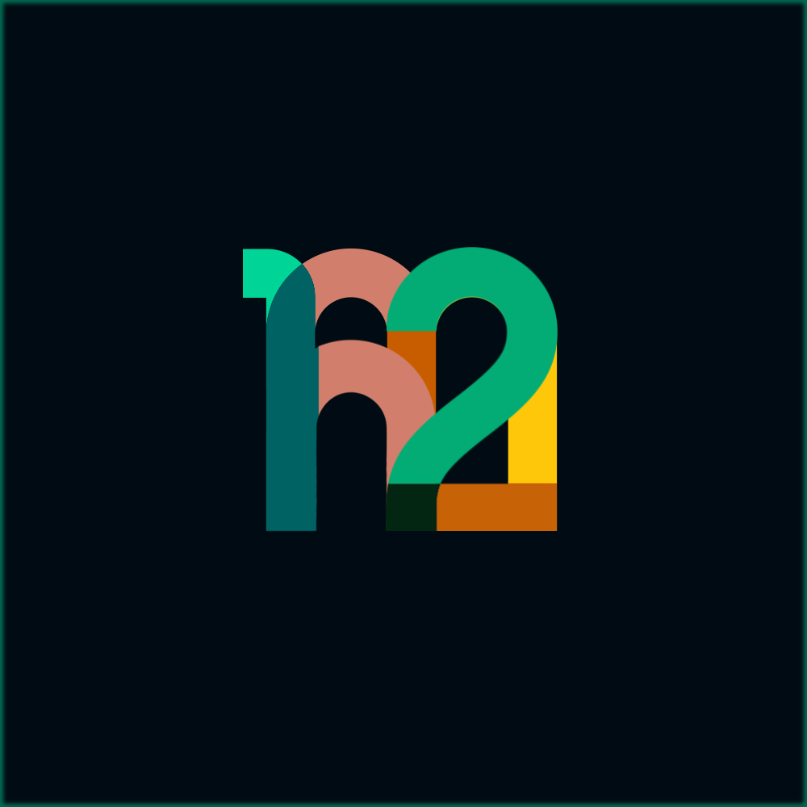

---
<h1 align="center">
    
     
    
</h1>

    The frictionless event manager
     

Table of Contents

- [About](#about)
    - [Description](#description)
    - [Motivation](#motivation)
    - [Features](#features)
    - [Roadmap](#roadmap)
    - [Built With](#built-with)
- [Getting Started](#getting-started)
  - [Tutorial](#tutorial)
  - [Screenshots](#screenshots)
- [Roadmap](#roadmap)
- [Maintainers](#maintainers)
- [License](#license)
- [Acknowledgements](#acknowledgements)

---

# About

**how2meet** is a *frictionless* event manager--meaning it is simple, free, easy to use, and does **NOT** require you or your guests to:
- Create an account
- Download an app

## Motivation

### __Facebook is dead:__ _But Facebook Events was :fire:_
- Facebook Events
- No one wants to download an app
- Planning a reunion with a big group of distributed, busy friends
- The hardest part of staying connected is someone taking charge and planning events. It takes time, effort, and often little thanks
-

## Features
- [ ] Host an event at a specific location, date, and time
- [ ] Send invites to guests via text, email, or web interface (link)
- [ ] Track RSVP responses, nudge those who haven't responded
- [ ] Admin access to limit attendees, kick out unknowns, change event details, and more!

## Roadmap
- [ ] When2meet-style group scheduler
- [ ] GCal URL integration
- [ ] Polls
- [ ] Photos and comments
- [ ] AI-powered planning assistant

## Built With
| Library                                 | Use            | Source                                          |
|-----------------------------------------|----------------|-------------------------------------------------|
| [nicegui](https://nicegui.io)           | GUI            | https://github.com/zauberzeug/nicegui/tree/main |
| [FastAPI](https://fastapi.tiangolo.com) | Backend        | https://github.com/tiangolo/fastapi             |
| [Render](https://render.com)            | Infrastructure | https://github.com/renderinc                    |

# Maintainers
| Name         | Email                |
|--------------|----------------------|
| Ben Memberg  | benmemberg@gmail.com |
| Connor Rubin | csrubin@gmail.com    |
| Taea Vogel   | taelxvie@gmail.com   |

# License
[GNU General Public License v3.0](https://choosealicense.com/licenses/gpl-3.0/)

# Acknowledgements / References

[when2meet](https://www.when2meet.com)
