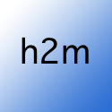
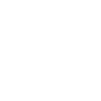

---
<h1 align="center">
    
     
    
     
    how2meet
</h1>

    Tagline goes here
     

Table of Contents

- [About](#about)
    - [Description](#description)
    - [Motivation](#motivation)
    - [Features](#features)
    - [Roadmap](#roadmap)
    - [Built With](#built-with)
- [Getting Started](#getting-started)
  - [Tutorial](#tutorial)
  - [Screenshots](#screenshots)
- [Roadmap](#roadmap)
- [Maintainers](#maintainers)
- [License](#license)
- [Acknowledgements](#acknowledgements)

---

# About
| TL;DR                                                                      |
|:---------------------------------------------------------------------------|
| TL;DR goes here. [Click here to jump to Getting Started](#getting-started) |

Some overview text here.

## Motivation

### __Interesting bold phrase:__ _Sassy retort_
More specific reasons here

## Features
- [ ] Feature

## Roadmap
- [ ] Upcoming feature

## Built With
| Library                                            | Use                          | Source                                       |
|----------------------------------------------------|------------------------------|----------------------------------------------|
| [nicegui](https://nicegui.io)                      | GUI                          | Github link here                             |

# Getting Started

## Tutorial

## Screenshots

# Maintainers
| Name         | Email                |
|--------------|----------------------|
| Ben Memberg  | benmemberg@gmail.com |
| Connor Rubin | csrubin@gmail.com    |
| Taea Vogel   | taelxvie@gmail.com   |

# License

# Acknowledgements / References
