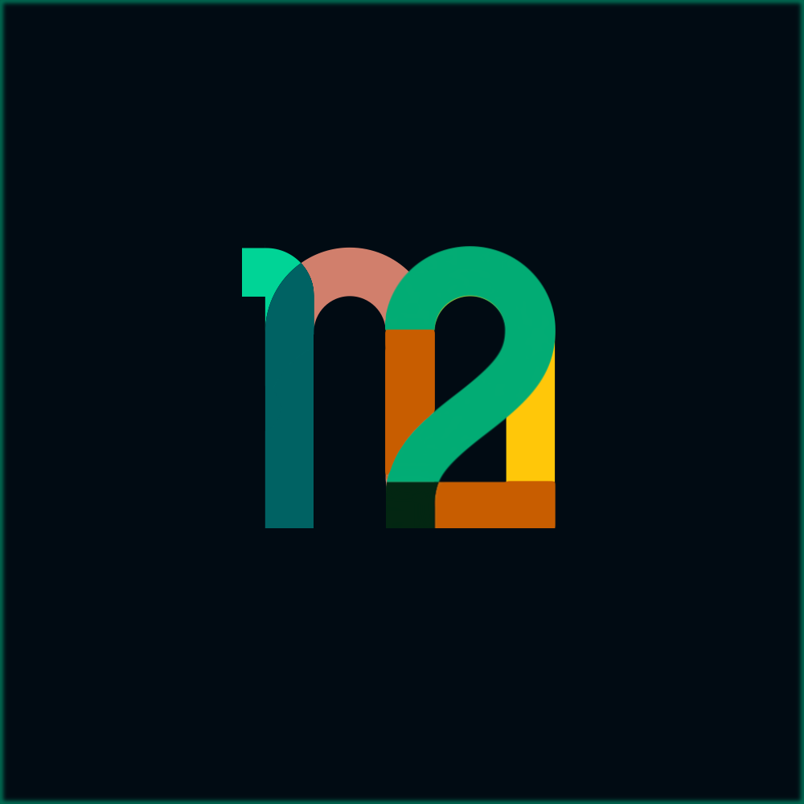

---
<h1 align="center">
    
     
    
</h1>

    The frictionless event manager
     

Table of Contents

- [About](#about)
    - [Motivation](#motivation)
    - [Features](#features)
    - [Roadmap](#roadmap)
    - [Built With](#built-with)
- [Roadmap](#roadmap)
- [Maintainers](#maintainers)
- [License](#license)
- [Acknowledgements](#acknowledgements)

---

# About

**how2meet** is a *frictionless* event manager--meaning it is simple, free, easy to use, and does **NOT** require you or your guests to:
- Create an account
- Give out your personal information to a service you're not sure that you can trust
- Download an app

Just create your event and send a link with whatever service you choose!

## Motivation

### __Facebook is dead :skull: :__ _But Facebook Events was :fire:_
- Facebook Events
- No one wants to download an app
- Planning a reunion with a big group of distributed, busy friends
- The hardest part of staying connected is someone taking charge and planning events. It takes time, effort, and often little thanks
-

## Features
- [x] Host an event at a specific location, date, and time
- [x] Send invites to guests via link
- [x] Track RSVP responses
- [x] Admin access to change event details

## Roadmap
- [ ] When2meet-style group scheduler
- [ ] GCal URL integration
- [ ] Polls
- [ ] Photos and comments
- [ ] AI-powered planning assistant
- [ ] Alternative communication paths (text, email, whatsapp, etc.)
- [ ] Nudge guests who haven't responded
- [ ] Geo-location search and presentation
- [ ] Admins to limit attendees, kick out unknowns

## Built With
| Library                                  | Use            | Source                                          |
|------------------------------------------|----------------|-------------------------------------------------|
| [nicegui](https://nicegui.io)            | GUI            | https://github.com/zauberzeug/nicegui/tree/main |
| [FastAPI](https://fastapi.tiangolo.com)  | Backend        | https://github.com/tiangolo/fastapi             |
| [Render](https://render.com)             | Infrastructure | https://github.com/renderinc                    |
| [SQLAlchemy](https://www.sqlalchemy.org) | ORM            | https://github.com/sqlalchemy/sqlalchemy        |
| [Postgres](https://www.postgresql.org)   | Database       | https://github.com/postgres                     |

# Maintainers
| Name         | Email                |
|--------------|----------------------|
| Ben Memberg  | benmemberg@gmail.com |
| Connor Rubin | csrubin@gmail.com    |
| Taea Vogel   | taelxvie@gmail.com   |

# License
[GNU General Public License v3.0](https://choosealicense.com/licenses/gpl-3.0/)

# Acknowledgements

[when2meet](https://www.when2meet.com)
